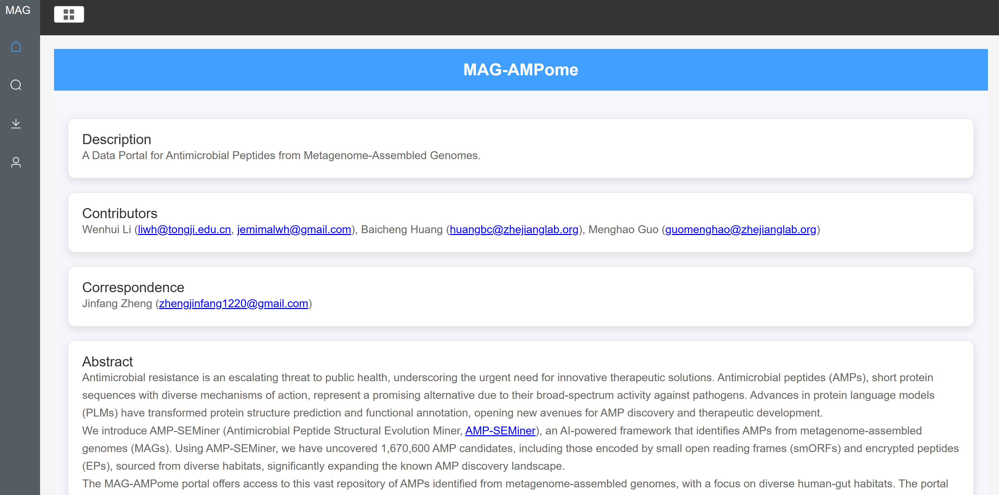
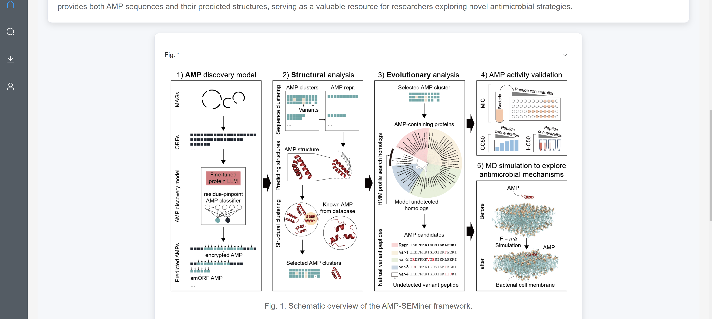
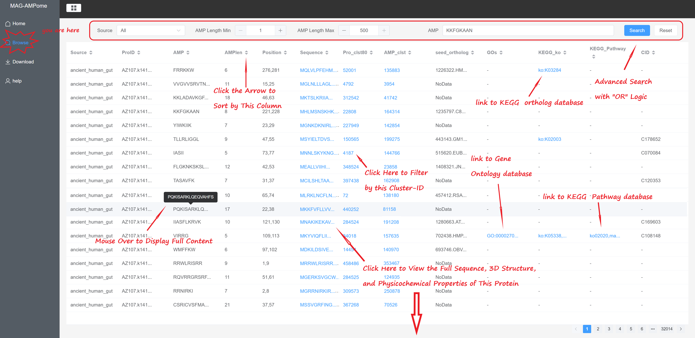
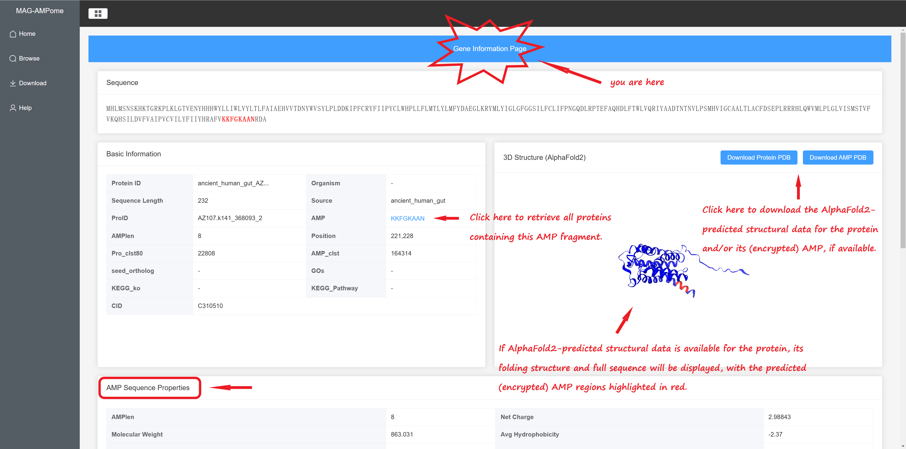
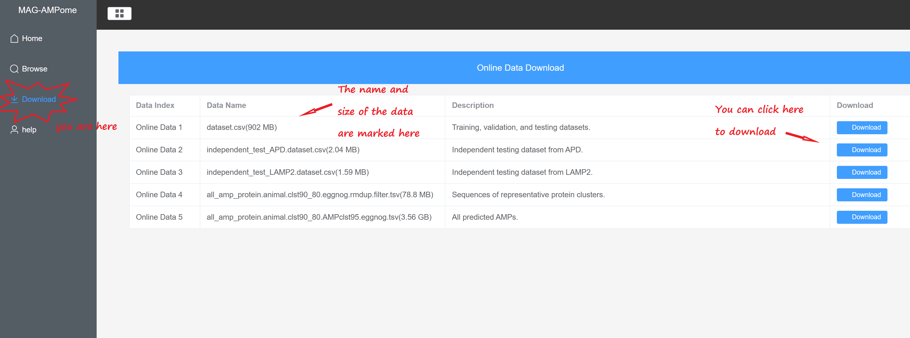

# AMP-SEMiner-Portal

# Introduction

This is the open-source code for the Data Portal([MAG-AMPome.aigene.org.cn](https://mag-ampome.aigene.org.cn/#/home)) of our latest article [Unveiling the Evolution of Antimicrobial Peptides in Gut Microbes via Foundation Model-Powered Framework](https://www.biorxiv.org/content/10.1101/2025.01.13.632881v1).

AMP-SEMiner (Antimicrobial Peptide Structural Evolution Miner) is an AI-driven framework developed to identify antimicrobial peptides (AMPs) from metagenome-assembled genomes (MAGs). You can access the code for AMP-SEMiner at [GitHub](https://github.com/zjlab-BioGene/AMP-SEMiner).

## 1.[backend](backend)
### 1.1 use docker
[backend_docker](backend/docker/use)

### 1.2 use python
[backend_python](backend/python/)

## 2.[frontend](frontend)

### 1.1 use npm
[frontend](frontend)

in step **1.use npm run preview**

### 1.2 use docker
[frontend](frontend)

in step **2.docker run**

# Citation
TBD

# Contact

Menghao Guo: [menghao.guo.319@gmail.com](menghao.guo.319@gmail.com)
